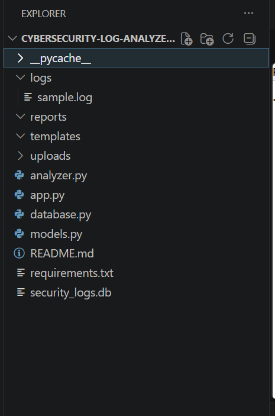
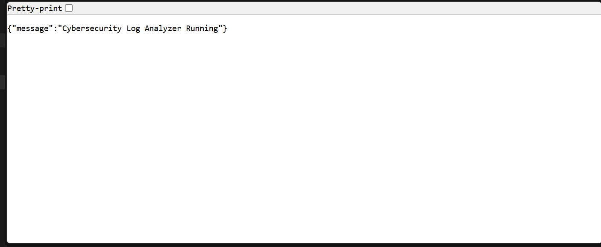
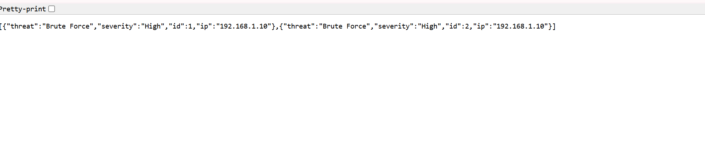
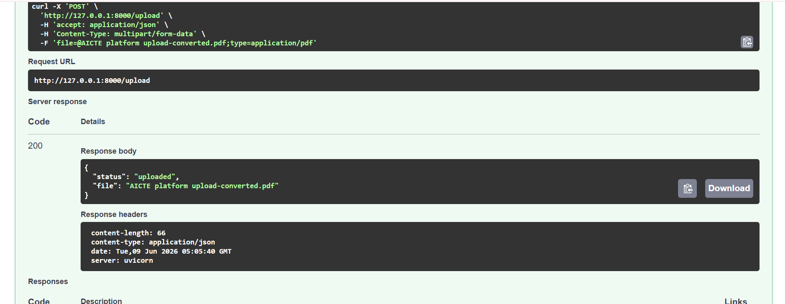
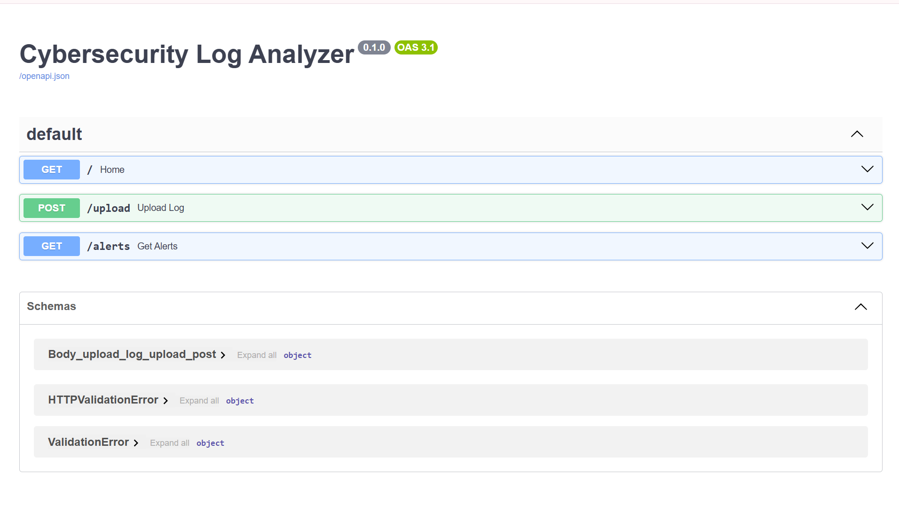

# 🛡️ Cybersecurity Log Analyzer V3

A FastAPI-based cybersecurity monitoring application that analyzes security logs, detects brute-force attacks, stores alerts in SQLite, and exposes REST APIs for threat management.

---

## 📌 Project Overview

Cybersecurity Log Analyzer V3 is a lightweight SIEM-inspired application developed using Python, FastAPI, SQLite, and SQLAlchemy.

The application:

- Analyzes security log files
- Detects brute-force attack attempts
- Stores alerts in SQLite database
- Provides REST APIs using FastAPI
- Supports file uploads
- Includes Swagger/OpenAPI documentation

---

## 🚀 Features

✅ Log File Analysis

✅ Brute Force Attack Detection

✅ SQLite Database Integration

✅ SQLAlchemy ORM

✅ FastAPI REST APIs

✅ File Upload API

✅ Alert Retrieval API

✅ Swagger Documentation

---

## 🛠️ Technology Stack

| Technology | Purpose |
|------------|----------|
| Python | Core Programming |
| FastAPI | REST API Development |
| SQLite | Database |
| SQLAlchemy | ORM |
| Uvicorn | ASGI Server |
| Regex | Log Parsing |

---

## 📂 Project Structure

```text
Cybersecurity-Log-Analyzer
│
├── Cybersecurity-Log-Analyzer/
│   ├── logs/
│   │   └── sample.log
│   │
│   ├── uploads/
│   ├── reports/
│   │
│   ├── analyzer.py
│   ├── app.py
│   ├── database.py
│   ├── models.py
│   ├── requirements.txt
│   ├── security_logs.db
│   └── README.md
│
├── screenshots/
│   ├── Project_Structure.png
│   ├── Home_API_Response.png
│   ├── Alert_API_Output.png
│   ├── Upload_API_Success.png
│   └── Swagger_Document.png
│
└── Cybersecurity_Log_Analyzer_Final_Report.pdf
```

### 📸 Project Structure



---

## ⚙️ Installation

### Clone the Repository

```bash
git clone https://github.com/YPragnavi/Cybersecurity-Log-Analyzer.git

cd Cybersecurity-Log-Analyzer
```

### Install Dependencies

```bash
pip install -r requirements.txt
```

---

## ▶️ Running the Project

### Step 1: Analyze Security Logs

```bash
python analyzer.py
```

Expected Output:

```text
Threats saved
```

### Step 2: Start FastAPI Server

```bash
python -m uvicorn app:app --reload
```

Expected Output:

```text
INFO: Uvicorn running on http://127.0.0.1:8000
```

### Step 3: Open Swagger Documentation

```text
http://127.0.0.1:8000/docs
```

---

## 🌐 API Endpoints

| Method | Endpoint | Description |
|----------|----------|----------|
| GET | / | Health Check |
| GET | /alerts | Retrieve Security Alerts |
| POST | /upload | Upload Log File |

---

## 🏠 Home API Response

### Endpoint

```http
GET /
```

### Response

```json
{
  "message": "Cybersecurity Log Analyzer Running"
}
```

### 📸 Screenshot



---

## 🚨 Alerts API

### Endpoint

```http
GET /alerts
```

### Sample Response

```json
[
  {
    "id": 1,
    "ip": "192.168.1.10",
    "threat": "Brute Force",
    "severity": "High"
  }
]
```

### 📸 Screenshot



---

## 📤 Upload API

### Endpoint

```http
POST /upload
```

### Sample Response

```json
{
  "status": "uploaded",
  "file": "sample.log"
}
```

### 📸 Screenshot



---

## 📚 Swagger Documentation

FastAPI automatically generates interactive API documentation using Swagger UI.

### 📸 Screenshot



---

## 🔄 System Workflow

```text
Security Log File
        │
        ▼
 Log Analyzer Engine
        │
        ▼
 Threat Detection
        │
        ▼
 SQLite Database
        │
        ▼
 FastAPI REST APIs
        │
        ▼
 Security Analyst
```

---

## 📊 Results

The application successfully:

- Parsed security log files
- Detected brute-force attacks
- Stored alerts in SQLite database
- Retrieved alerts using REST APIs
- Uploaded files through FastAPI
- Tested APIs using Swagger UI

---

## 🔐 Security Features

- Brute Force Attack Detection
- Security Log Analysis
- Alert Management
- SQLite-Based Threat Storage
- API-Based Monitoring

---

## 🎯 Learning Outcomes

This project helped in understanding:

- FastAPI Development
- REST API Design
- SQLAlchemy ORM
- SQLite Database Integration
- Cybersecurity Log Analysis
- Threat Detection Techniques
- Swagger/OpenAPI Documentation
- Python Backend Development

---

## 🔮 Future Enhancements

- SQL Injection Detection
- Cross-Site Scripting (XSS) Detection
- JWT Authentication
- Real-Time Monitoring
- Dashboard using Plotly
- PDF Report Generation
- Docker Deployment
- Email Alert Notifications

---

## 📄 Project Report

Detailed project documentation is available in:

```text
Cybersecurity_Log_Analyzer_Final_Report.pdf
```

---

## 👨‍💻 Author

### Pragnavi Yemireddy

Cybersecurity Enthusiast | Python Developer | SOC Analyst Aspirant
